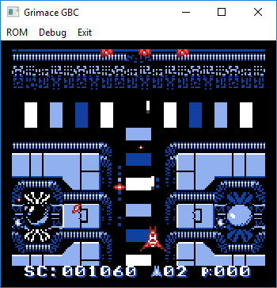

# New Grimace GBC (GameBoy Color Emulator)
Emulator designed to play GameBoy and GameBoy Color games on a Windows PC.

Game shown is 'Alien Planet' by Patriek Lesparre, ©2001 The New Image, distributed as freeware (not sold or published by Nintendo). Available at [pdroms.de](http://pdroms.de/files/gameboy/alien-planet)

## About
The program uses the Windows API and OpenGL to create an environment on a Windows PC to play a GameBoy game, using keyboard as input and displaying the game in a resizeable window.
C++ object-oriented code is used to implement an emulator object, which simulates the GameBoy's Z80-like CPU, along with its memory structure and other components. Audio emulation is currently very, very disappointing.
The program is not distributed with any ROM (game) files. Games that were published or distributed by Nintendo are owned by Nintendo, and their distribution or ownership may be illegal in some regions. I do not encourage any unlawful acquisition or distribution of any property owned by Nintendo or another company.

## Installation Instructions
You will require Visual Studio installed on your computer, including the component for desktop Windows C++ development.
* Clone this repository
* Download 'glext.h' from [The Khronos Group Inc](https://www.khronos.org/registry/OpenGL/api/GL/glext.h) and place it in the 'NewGrimaceGBC' source code directory
* Open the Visual Studio Solution file in the root directory
* Build the solution to create the .exe file
